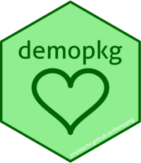

<!-- README.md is generated from README.Rmd. Please edit that file -->

```{r, include = FALSE}
knitr::opts_chunk$set(
  collapse = TRUE,
  comment = "#>",
  fig.path = "man/figures/README-",
  out.width = "100%"
)
```

# demopkg 

<!-- badges: start -->
[](https://lifecycle.r-lib.org/articles/stages.html#experimental)
<!-- badges: end -->

The goal of demopkg is to practice making and sharing a package in R.

## Installation

You can install the development version of demopkg like so:

```{r, eval=FALSE}
devtools::install_github("miriamschulz/rproj")
```
